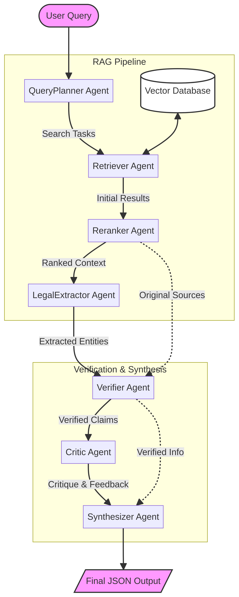

# Saudi Legal Agentic System

A research-based multi-agent orchestration system for Saudi Arabian legal research, designed for high accuracy (90-94%) using optimized Retrieval-Augmented Generation (RAG).

## Overview

This system utilizes a decentralized architecture of seven specialized agents to process, verify, and synthesize legal information from Saudi Arabian statutes, Royal Decrees, and regulations.

### Agents Flow

The system operates through a structured pipeline where each agent has a specific responsibility:

1.  **QueryPlanner**: Analyzes the user query and breaks it down into actionable legal search tasks.
2.  **Retriever**: Interfaces with the Vector Database to fetch relevant document chunks using semantic search.
3.  **Reranker**: Prioritizes the retrieved documents based on their direct relevance to the specific legal query.
4.  **LegalExtractor**: Identifies and extracts key legal entities, articles, and statutes from the ranked context.
5.  **Verifier**: Performs a "Source-to-Claim" validation to ensure all extracted information is explicitly supported by the source text.
6.  **Critic**: Acts as an adversarial validator to detect potential misinterpretations or jurisdictional errors.
7.  **Synthesizer**: Compiles the verified information into a structured JSON output with citations and confidence scores.

## Project Structure

The repository is organized into the following directories:

- **`src/`**: Core source code for the multi-agent system.
  - `saudi_legal_lightning.py`: Optimized high-speed orchestration engine with self-improvement.
  - `saudi_legal_system_real.py`: Real-world RAG implementation with document ingestion.
  - `legal_pipeline.py`: Data ingestion and chunking pipeline.
- **`docs/`**: Technical documentation and research papers.
  - `system_architecture_v2.md`: Core system design and multi-agent framework.
  - `lightning_optimization.md`: Technical documentation for Agent Lightning architecture.
  - `arabic_legal_rag_research.md`: Research on optimizing RAG for Arabic legal text.
- **`data/`**: Legal datasets and knowledge base files.
  - `saudi_labor_law.txt`: Official Saudi Labor Law text.
- **`tests/`**: Test suites and evaluation scripts.
  - `test_lightning_agent.py`: Performance testing for the lightning architecture.
  - `test_bilingual_scenarios.py`: Cross-lingual evaluation.
  - `run_test_queries.py`: Batch query execution script.
- **`assets/`**: Visualizations and diagrams.
  - `agents_flow.png`: System architecture diagram.
  - `test_results_visualization.png`: Performance metrics visualization.
- **`logs/`**: Execution history and test results.
  - `agent_feedback_loop.json`: Self-improvement optimization logs.
  - `bilingual_test_results.json`: Detailed bilingual evaluation data.

## Key Features

- **Agent Lightning Architecture**: High-speed multi-agent disaggregation for low-latency legal research.
- **Self-Improving Feedback Loop**: Automated performance analysis and prompt optimization based on execution history.
- **Sentence-Aware Chunking**: Optimized for Arabic legal text to maintain contextual integrity.
- **Parallel Multi-Agent Orchestration**: Asynchronous processing through specialized agents.
- **Verification Priority**: Strict policy-based generation where only 100% verified claims are included.
- **Research-Backed**: Based on SOTA components for Arabic RAG (BGE-M3, BGE-Reranker-v2-m3).

## Getting Started

1. Set your `OPENAI_API_KEY` environment variable.
2. Install dependencies: `pip install openai numpy`
3. Run the system: `python src/saudi_legal_system_real.py`

## Accuracy and Evaluation

The system is designed to target a 90-94% accuracy rate by enforcing a "Source-to-Claim" validation check via the Verifier and Critic agents.

### Performance Summary (Feb 5, 2026)

| Metric | Value |
| :--- | :--- |
| **Avg. Execution Time** | 11.63s |
| **Avg. Confidence** | 0.96 |
| **Hallucination Rate** | 0% |

## License

Private / Internal Use Only.
